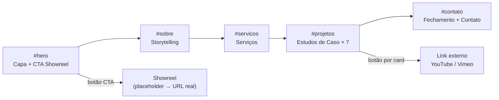

## Objetivo

Produzir dois arquivos entregáveis a partir de uma única base de conteúdo:
1. `portfolio-filmagem-no-laje.html` — página web standalone (abre em qualquer navegador, sem servidor)
2. `portfolio-filmagem-no-laje.pdf` — versão PDF interativa gerada a partir do HTML via script Python (ReportLab + WeasyPrint ou Playwright)

---

## Arquitetura de Arquivos

```
verdent-project/
├── portfolio-filmagem-no-laje.html   ← entregável principal
├── portfolio-filmagem-no-laje.pdf    ← gerado via script
├── generate_pdf.py                   ← script de conversão HTML → PDF
└── assets/
    ├── thumbnails/                   ← frames/imagens dos projetos (a fornecer)
    │   ├── estado-de-alegria.jpg
    │   ├── salvador-que-pulsa.jpg
    │   ├── mixxxture-now.jpg
    │   ├── as-merendeiras.jpg
    │   ├── o-gura.jpg
    │   ├── quando-eu-crescer.jpg
    │   └── capoeira.jpg
    └── showreel-placeholder.jpg      ← frame de capa (a fornecer)
```

---

## Sistema de Design

| Token | Valor |
|---|---|
| `--bg` | `#0A0A0A` (preto profundo) |
| `--surface` | `#111111` |
| `--accent` | `#E63228` (vermelho cinematográfico) |
| `--text-primary` | `#F5F5F5` |
| `--text-muted` | `#888888` |
| `--border` | `#222222` |
| Tipografia título | **Bebas Neue** (Google Fonts, via `@import`) |
| Tipografia corpo | **Inter** (Google Fonts) |
| Grid base | CSS Grid + Flexbox, sem frameworks externos |

---

## Estrutura de Seções (HTML + conteúdo refinado)

### Seção 1 — CAPA (`#hero`)

**Layout:** Tela cheia (`100vh`), imagem/frame em background com overlay escuro 70%, conteúdo centralizado verticalmente.

**Hierarquia visual:**
```
[ FILMAGEM NO LAJE ]         ← h1, Bebas Neue, 96px, branco
[ Portfólio Audiovisual 2026 ]  ← h2, Inter light, 18px, vermelho
[ Outras formas de ver        ]  ← blockquote, 24px, branco/70%
[ e praticar o mundo.         ]
[  ▶  ASSISTIR AO SHOWREEL   ]  ← botão CTA, fundo vermelho, link placeholder "#showreel"
```

---

### Seção 2 — SOBRE (`#sobre`)

**Layout:** Duas colunas — coluna esquerda com título vertical rotacionado "SOBRE", coluna direita com texto.

**Texto refinado:**

> A imagem é uma linguagem viva — não um registro, mas uma escolha.
>
> Enilton atua no audiovisual com visão sistêmica: da concepção visual na direção de fotografia à montagem final, passando pela operação de câmera e pelo suporte à direção. Essa integração entre funções não é acidente — é método. Filmar já com o olhar da montagem significa que cada plano carrega intencionalidade desde o set.
>
> O território entre o documentário e a ficção é onde a marca **FILMAGEM NO LAJE** opera com mais potência: transmutando ideias em imagens que existem tanto no real quanto no imaginário.

---

### Seção 3 — SERVIÇOS (`#servicos`)

**Layout:** Grid 2×2 de cards com ícone minimalista, título da categoria e lista de entregas.

| Card | Título | Entregas listadas |
|---|---|---|
| 01 | **Direção de Fotografia** | Concepção visual, paleta de luz, decupagem de câmera, linguagem de cor |
| 02 | **Operação de Câmera** | Câmera em mão, steadicam, tripé dramático, cobertura documental |
| 03 | **Edição & Montagem** | Corte narrativo, montagem paralela, color grading, finalização |
| 04 | **Assistência de Direção & Produção** | Gestão de set, breakdown de roteiro, suporte à direção, relatórios de produção |

---

### Seção 4 — PROJETOS (`#projetos`)

**Layout:** Cards em grid responsivo (1 coluna mobile / 2 colunas desktop). Cada card: thumbnail em destaque, badge de função, título, linha de contexto, botão "Ver vídeo completo".

#### Conteúdo dos 7 estudos de caso:

| # | Título | Função | Linha de contexto |
|---|---|---|---|
| 1 | **Estado de Alegria — Carnaval Bahia 2026** | Direção de Fotografia / Operação de Câmera | Cobertura audiovisual do carnaval baiano com linguagem entre o jornalístico e o poético |
| 2 | **Salvador que Pulsa** | Direção de Fotografia / Edição | Retrato urbano da cidade de Salvador — ritmo, pele e território |
| 3 | **Mixxxture Now!** | Operação de Câmera / Edição | Registro de evento cultural com montagem rítmica orientada pela música |
| 4 | **As Merendeiras** | Direção de Fotografia / Montagem | Documentário sobre trabalhadoras da alimentação escolar — olhar íntimo e político |
| 5 | **O Gura** | Direção de Fotografia / Edição | Ficção curta com construção visual densa e narrativa de personagem |
| 6 | **Quando eu Crescer** | Operação de Câmera / Assistência de Direção | Produção com crianças — gestão de set e sensibilidade documental aplicada à ficção |
| 7 | **Capoeira** | Direção de Fotografia / Edição | Registro da capoeira como linguagem corporal e cultural — movimento como dramaturgia |

> Cada botão "Ver vídeo completo" receberá o link YouTube/Vimeo correspondente ao fornecer os URLs.

---

### Seção 5 — CONTATO (`#contato`)

**Layout:** Tela cheia com fundo vermelho sólido, texto centralizado.

```
[ Vamos criar juntos? ]          ← h2, Bebas Neue, 72px, preto
[ filmagemnolajecinema@gmail.com ]  ← link mailto:, Inter, 20px
[ @filmagem.no.laje ]            ← link instagram.com/filmagem.no.laje, Inter, 20px
```

---

## Fluxo de Navegação



---

## Geração do PDF (`generate_pdf.py`)

- Usa **Playwright** (headless Chromium) para renderizar o HTML e exportar PDF com links clicáveis preservados
- Formato: A4 landscape ou widescreen 16:9 (a definir por você)
- Dependência: `pip install playwright` + `playwright install chromium`
- Output: `portfolio-filmagem-no-laje.pdf` no mesmo diretório

---

## Etapas de Implementação

1. **Criar `portfolio-filmagem-no-laje.html`**
   - Estrutura HTML5 semântica com todas as 5 seções
   - CSS inline no `<style>` (sem dependências externas além de Google Fonts via CDN)
   - Textos refinados conforme tabelas acima
   - Thumbnails dos projetos referenciadas em `assets/thumbnails/`

2. **Criar `generate_pdf.py`**
   - Script Playwright para abrir o HTML local e exportar PDF
   - Configuração de margens zero e preservação de links

3. **Substituições posteriores (sem retrabalho de código)**
   - Link do Showreel: trocar `href="#showreel"` pelo URL real
   - Links dos projetos: preencher `data-video-url` de cada card
   - Thumbnails: colocar as imagens em `assets/thumbnails/` com os nomes mapeados

---

## Critérios de Conclusão (DoD)

| Etapa | Alvo | Verificação |
|---|---|---|
| HTML criado | `portfolio-filmagem-no-laje.html` | Abre no Chrome/Edge sem erros, todas as seções visíveis, links de e-mail e Instagram funcionam |
| PDF gerado | `portfolio-filmagem-no-laje.pdf` | PDF abre, botões são clicáveis, tipografia preservada |
| Responsividade | Mobile 375px / Desktop 1440px | Nenhum overflow horizontal, grid adapta de 2→1 coluna |
| Textos | Todas as 5 seções | Conteúdo conforme briefing, sem placeholder de texto |
